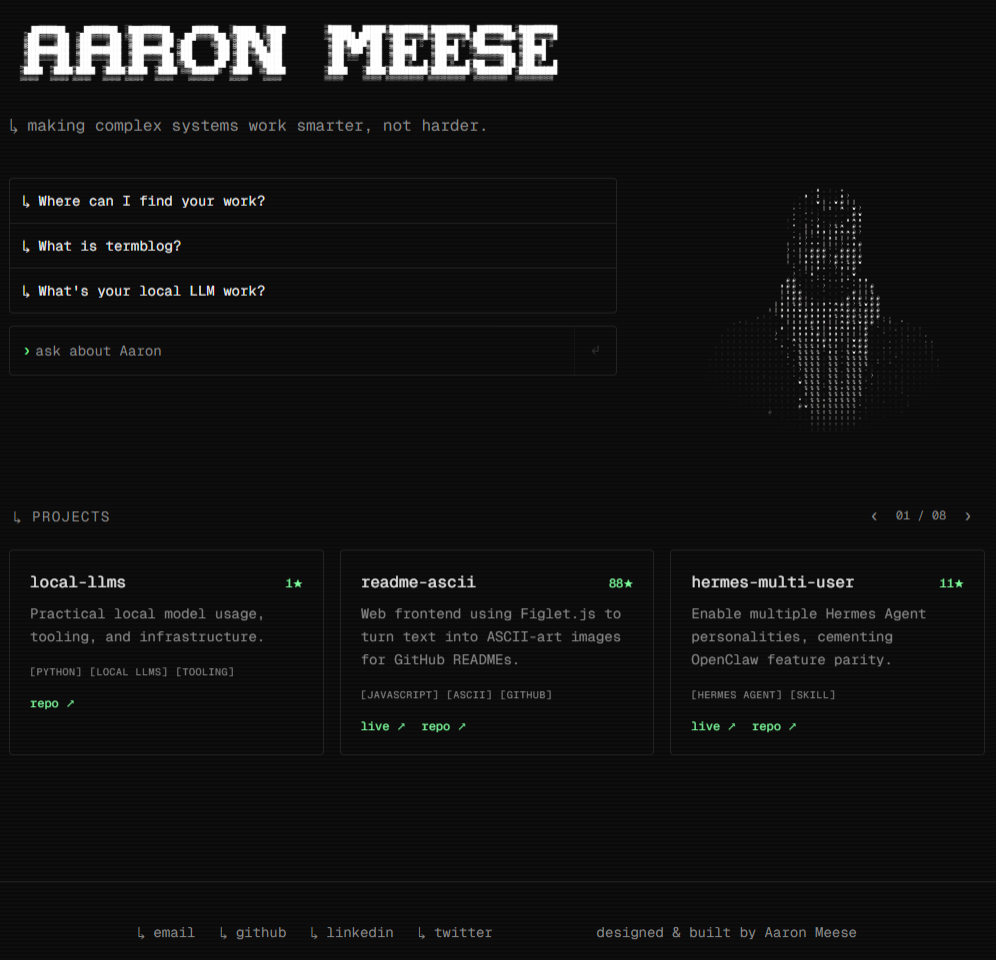

# agentic-portfolio

Interact with a digital clone of me. Next.js app rendering a live ASCII portrait driven by a 3D avatar (TalkingHead + custom GPU ASCII pass).



## Credits
- **Inspiration:** [Matthew Peterson](https://www.matthewpetersen.ca/)
- **Name image generation:** [README ASCII](https://github.com/ajmeese7/readme-ascii)
  - *Font:* DOS Rebel - [Valerie Mates](https://www.unixmama.com/)

## Requirements

- Node.js 22+ (developed on 22.22.0)
- pnpm 10+ (developed on 10.33.2). The repo uses `pnpm` patches via `pnpm-workspace.yaml`, so npm/yarn will skip the patch and ship a broken TalkingHead build.

## Install

```sh
pnpm install
```

This applies `patches/@met4citizen__talkinghead@1.7.0.patch` automatically. If you ever see avatar regressions after upgrading that package, re-check the patch still applies cleanly (the version in the filename is the resolved package version pnpm tracks).

## Run

Dev server (Turbopack, hot reload):

```sh
pnpm dev
```

Defaults to `http://localhost:3000`. If 3000 is taken, Next picks the next free port and prints it.

LAN access (phone, other machine on the same network) requires the firewall to allow the dev port. Add your LAN IPs to `ALLOWED_DEV_ORIGINS` in `.env.local` (comma-separated); loopback origins are always allowed.

## Build

Production build and serve:

```sh
pnpm build
pnpm start
```

`pnpm start` serves the built output on port 3000 by default. Override with `PORT=4000 pnpm start`.

## Quality gates

```sh
pnpm typecheck   # tsc --noEmit
pnpm lint        # biome check src
pnpm fmt         # biome format --write src
```

No test suite yet.

## Layout

- `src/app/` — Next App Router entry (single page, full-bleed avatar).
- `src/components/` — ASCII pipeline:
  - `TalkingHeadAscii.tsx` — top-level client component.
  - `useTalkingHeadAscii.ts` — boots TalkingHead, wires the GPU ASCII pass.
  - `AsciiEffect.ts` — fragment-shader ASCII pass.
  - `buildCharacterAtlas.ts` — generates the glyph atlas at runtime.
- `public/avatar.glb` — meshopt-compressed 3D model the avatar renders from.
- `assets/avatar.source.glb` — uncompressed source. Regenerate `public/avatar.glb` via `pnpm compress:avatar`.
- `scripts/` — build helpers (currently just the avatar compression script).
- `patches/` — pnpm-managed patches for upstream deps.
- `docs/controls.md` — runtime interactions and edit-time tuning knobs.
- `reference/` — local-only ground-truth clone of the visual target. Gitignored.

## Known gotchas

- **npm/yarn break the avatar.** Use pnpm so the TalkingHead patch applies.
- **LAN access needs UFW open** for whichever port `pnpm dev` lands on, and the device's IP added to `ALLOWED_DEV_ORIGINS` in `.env.local`.
